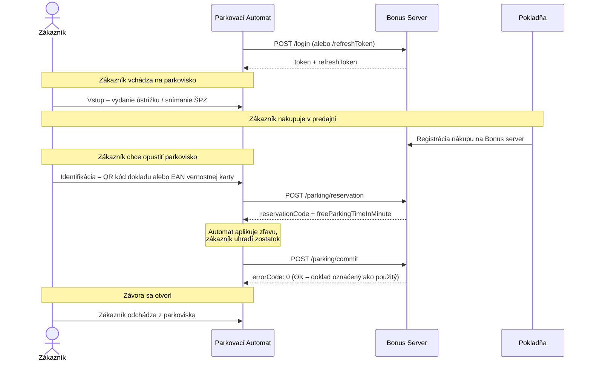

# Bonus – Modul Parkovanie

## Dokumentácia API Rozhrania

> \*\*Verzia:\*\* 001 | \*\*Dátum vydania:\*\* 08.09.2026

\---

## 1\. Všeobecné informácie a popis projektu

Tento materiál k informačnému systému **Bonus – modul parkovanie**, ktorý je prevádzkovaný organizáciou COOP jednota SLOVENSKO (ďalej CJS), popisuje spôsob realizácie podpory zvýhodnenia pre zákazníkov COOP jednota pri nákupoch v ich predajniach.

Zvýhodnenie spočíva v rôznej forme úľavy v prípade parkovania motorového vozidla na sledovanom parkovisku predajne COOP jednota v časovom súbehu s realizovaným nákupom v danej predajni.

Jednotlivé spotrebné družstvá COOP jednota využitím tu popisovaných postupov získajú nástroj pre podporu technickej realizácie. Parkovací systém predajne má k dispozícii overenie údajov spojených s nákupom užívateľa motorového vozidla v danej predajni.

> \[!WARNING]
> Pre správne využívanie systému Bonus – modul parkovanie je nutné využívať výhradne technické postupy v súlade s touto dokumentáciou a vyhnúť sa akýmkoľvek iným nepopísaným postupom. Prevádzkovateľ systému Bonus (CJS) a tvorca (NRSYS s.r.o.) zodpovedajú len za situácie, ktoré sú v súlade s touto dokumentáciou.

\---

## 2\. Prostredia a adresy

|Prostredie|Typ|Adresa / URL|Poznámka|
|-|-|-|-|
|**Produkcia**|Web API|*(doplní sa)*|Hlavná produkčná API adresa|
|**Produkcia**|Webový portál|*(doplní sa)*|Aplikácia pre centrálny a regionálny management|
|**Test**|Web API|`https://bonusservice.COOP.sk`|Testovacia API adresa|
|**Test**|Webový portál|`https://bonusportal-test.nic.sk`|Testovacia aplikácia pre management|

**Podpora a Helpdesk:**

* **Email (vývoj):** `bonus@nrsys.sk`

\---

## 3\. Komunikácia, autorizácia a štandardy

Aby pokladňa mohla plnohodnotne komunikovať s Web API funkciami Bonus servera, musí byť v systéme Bonus zaregistrovaná (definovaná svojim `CashRegisterCode` a heslom `CashRegisterSecret`) a zaradená v hierarchii predajní.

### 3.1 Formát a kódovanie

* **Protokol:** HTTP
* **Formát dát:** JSON
* **Kódovanie:** UTF-8
* **Dátum a čas:** ISO 8601 (napr. `"2021-03-21T17:08:17.271Z"`)
* **Autorizácia:** `Bearer {TOKEN}`

### 3.2 Základná URL štruktúra

Adresa pre všetky metódy sa skladá zo základnej URL, verzie API a názvu metódy:

```http
https://bonusservice-test.COOP.sk/{VERZIA}/{METODA}
```

*Aktuálna verzia API (`{VERZIA}`): **`v16`***

### 3.3 Hraničná doba odozvy (Timeout)

Pre komunikáciu na Bonus server je potrebné dodržať hraničnú dobu odozvy stanovenú na **2 sekundy**.

> \[!TIP]
> Tento parameter odporúčame na automate parametrizovať. Individuálne problémy s komunikáciou je potom možné riešiť zvýšením tejto hodnoty, aby sa predišlo duplicitám evidovaných dokladov.

### 3.4 Spoločné atribúty odpovede (Response)

Všetky odpovede (okrem `/login` a `/refreshToken`) majú túto základnú množinu atribútov:

|Parameter|Typ|Význam|
|-|-|-|
|`errorCode`|String|Kód biznis chyby|
|`errorMessage`|String|Popis výsledku chyby|

\---

## 4\. Zoznam API Metód

|Metóda|HTTP|Autorizácia|Význam|
|-|-|:-:|-|
|**`/echo`**|`GET`|Nie|Test spojenia so serverom|
|**`/login`**|`POST`|Nie|Prihlásenie automatu, získanie autorizačného tokenu|
|**`/refreshToken`**|`POST`|Nie|Obnovenie tokenu pomocou refresh tokenu|
|**`/parking/reservation`**|`POST`|Áno|Rezervácia uplatnenia zľavy z parkovania|
|**`/parking/commit`**|`POST`|Áno|Potvrdenie rezervácie (zúčtovanie)|
|**`/parking/cancel`**|`POST`|Áno|Stornovanie rezervácie|

\---

## 5\. Detailná špecifikácia Endpointov

### 5.1 Echo

Slúži na overenie komunikácie a dostupnosti servera.

* **Endpoint:** `GET /v16/echo`
* **Autorizácia:** Nevyžaduje sa

**Výstupné parametre (Response):**

|Parameter|Typ|Význam|
|-|-|-|
|`resNum`|Integer|`0` = OK|
|`message`|String|Aktuálny dátum + "Echo"|
|`version`|String|Verzia použitej knižnice Business.DLL|


### 5.2 Login

Prihlásenie parkovacieho automatu do systému a získanie autentizačného tokenu (platnosť zvyčajne 4 hodiny) a refresh tokenu (platnosť zvyčajne 24 hodín).

* **Endpoint:** `POST /v16/login`
* **Autorizácia:** Nevyžaduje sa

**Vstupné parametre (Request):**

```json
{
    "userName": "automat0001",
    "password": "0001JKA"
}
```

**Výstupné parametre (Response):**

|Parameter|Typ|Význam|
|-|-|-|
|`resNum`|Integer|Návratový kód (viď tabuľku nižšie)|
|`token`|String|Autentizačný Bearer token|
|`refreshToken`|String|Token pre obnovenie expirujúceho tokenu|
|`tokenExpireAt`|Datetime|Dátum a čas expirácie tokenu|
|`refreshTokenExpireAt`|Datetime|Dátum a čas expirácie refresh tokenu|
|`resultItems`|Array|Typ regiónu / doplnkové dáta|

**Príklad odpovede:**

```json
{
    "token": "eyJhbGciOiJIUzI1NiIs...",
    "refreshToken": "eyJhbGciOiJIUzI1NiIs...",
    "tokenExpireAt": "2026-09-08T18:54:21.8465923+02:00",
    "refreshTokenExpireAt": "2026-09-09T14:54:21.8467456+02:00",
    "error": false,
    "resNum": 0,
    "resultItems": \[]
}
```

**Možné hodnoty resNum:**

|resNum|Význam|
|:-:|-|
|**0**|OK|
|**-301**|Chybné prihlásenie pokladne|
|**-302**|Chyba autentifikácie|


### 5.3 Refresh Token

Slúži na obnovenie autorizačného tokenu bez nutnosti znova posielať prihlasovacie meno a heslo.

* **Endpoint:** `POST /v16/refreshToken`
* **Autorizácia:** Nevyžaduje sa

**Vstupné parametre (Request):**

```json
{
    "refreshToken": "eyJhbGciOiJIUzI1NiIs..."
}
```

*Poznámka: Výstup je identický s metódou Login.*


### 5.4 Rezervácia

Automat volá túto metódu vo chvíli, keď zákazník ukončil nákup a realizuje pri automate koncovú úhradu, aby mohol opustiť parkovisko. Zákazník naskenuje QR kód z pokladničného dokladu alebo EAN kód svojej vernostnej karty.

* **Endpoint:** `POST /v16/parking/reservation`
* **Autorizácia:** Vyžaduje sa (Bearer Token)

**Vstupné parametre (Request):**

```json
{
    "parkingCode": "automat0001",
    "entryDateTime": "2026-09-08T13:00:00.000Z",
    "customerIdentifier": "O-5090008626524D0B90008626521D0BAC"
}
```

**Výstupné parametre (Response):**

|Parameter|Typ|Význam|
|-|-|-|
|`reservationCode`|String|Kód rezervácie pre identifikáciu operácie v ďalších metódach|
|`freeParkingTimeInMinute`|Integer|Čas (v minútach), počas ktorého by mal mať zákazník parkovanie zdarma|
|`errorCode`|Integer|Návratový kód (viď tabuľku nižšie)|
|`errorMessage`|String|Popis chyby|

**Príklad odpovede:**

```json
{
    "reservationCode": "EA78144F82F94C0482A415ACC8B586EB",
    "freeParkingTimeInMinute": 30,
    "errorCode": 0,
    "errorMessage": ""
}
```

**Možné hodnoty errorCode:**

|errorCode|errorMessage|
|:-:|-|
|**0**|OK|
|**-1**|Kód parkovacieho automatu nie je v zozname!|
|**-2**|Nezadaný customerIdentifier!|
|**-3**|Nezadaný entryDatetime!|
|**-4**|Zákazník ani doklad nenájdený!|
|**-5**|Doklad má skorší dátum ako vstup na parkovisko!|
|**-6**|Pre zadaného zákazníka nebol nájdený žiaden doklad po vstupe na parkovisko!|
|**-7**|Nenájdená hodnota voľného parkovania vyhovujúca nájdenému nákupu!|
|**-8**|Parkovanie na uvedený doklad už bolo využité!|
|**-9**|Pre zadaného zákazníka boli nájdené iba použité doklady po vstupe na parkovisko!|
|**-10**|Parkovanie na uvedený doklad už existuje pre inú pokladňu!|
|**1**|Nepotvrdená rezervácia pre daného zákazníka a parkovací automat už existuje!|
|**2**|Nepotvrdená rezervácia pre daný nákup už existuje!|


### 5.5 Potvrdenie rezervácie (Commit)

Po úspešnom zúčtovaní zákazníka (napríklad úhrade zostávajúcej čiastky) sa touto metódou označí rezervácia ako uplatnená. Tým sa zabráni opätovnému použitiu toho istého dokladu.

* **Endpoint:** `POST /v16/parking/commit`
* **Autorizácia:** Vyžaduje sa (Bearer Token)

**Vstupné parametre (Request):**

```json
{
    "parkingCode": "automat0001",
    "reservationCode": "EA78144F82F94C0482A415ACC8B586EB"
}
```

**Výstupné parametre (Response):**

```json
{
    "errorCode": 0,
    "errorMessage": ""
}
```

**Možné hodnoty errorCode:**

|errorCode|errorMessage|
|:-:|-|
|**0**|OK|
|**-1**|Kód parkovacieho automatu nie je v zozname!|
|**-2**|Nezadaný reservationCode!|
|**-3**|Pre zadaný automat a rezervačný kód nebol nájdený žiaden nepotvrdený záznam!|
|**-4**|Rezervačný kód pre zadaný automat nebol nájdený!|
|**-5**|Potvrdenie rezervácie sa nepodarilo!|


### 5.6 Stornovanie rezervácie (Cancel)

Volá sa v prípade, ak je potrebné už vytvorenú rezerváciu zrušiť (napríklad zákazník transakciu na automate zrušil alebo nastala iná technická chyba).

* **Endpoint:** `POST /v16/parking/cancel`
* **Autorizácia:** Vyžaduje sa (Bearer Token)

**Vstupné parametre (Request):**

```json
{
    "parkingCode": "automat0001",
    "reservationCode": "EA78144F82F94C0482A415ACC8B586EB"
}
```

**Možné hodnoty errorCode:**

|errorCode|errorMessage|
|:-:|-|
|**0**|OK|
|**-1**|Kód parkovacieho automatu nie je v zozname!|
|**-2**|Nezadaný reservationCode!|
|**-3**|Pre zadaný automat a rezervačný kód nebol nájdený žiaden nepotvrdený záznam!|
|**-4**|Rezervačný kód pre zadaný automat nebol nájdený!|
|**-5**|Zrušenie rezervácie sa nepodarilo!|

\---

## 6\. HTTP Stavové kódy

* **200 OK**: Volanie prebehlo úspešne. Je potrebné čítať JSON odpoveď pre zistenie prípadných biznis chýb v `errorCode`.
* **401 Unauthorized**: Chýba hlavička `Authorization: Bearer {TOKEN}` alebo token exspiroval. Riešenie: Zavolať `/refreshToken`, prípadne znova `/login`.
* **404 Not Found**: Neplatná URL adresa – skontrolujte adresu a verziu API.
* **500 Internal Server Error**: Interná chyba na strane Bonus servera (napr. chyba pripojenia na DB). *Ak server opakovane vracia 500, automat môže dočasne (napr. na 15 minút) volania ignorovať.*

\---

## 7\. Chybové scenáre

### 7.1 CHS\_01\_01 – Bonus server neodpovedá

**Situácia:** Bonus server neodpovedá na volania.  
**Vstupná podmienka:** Pri volaní metód Bonus server neodpovedá.

|Krok|Akcia / Vstup|Neočakávaný výsledok|Odporúčaná akcia|
|:-:|-|-|-|
|**1**|Volanie metód Bonus servera. Najmä frekventované dotazy typu `reservation`, `commit`.|Bonus server do určeného Timeout-u **(2 sekundy)** neodpovedá. Prevádzka automatu je spomaľovaná.|Po **druhom volaní za sebou**, ktoré skončilo Timeout-om, automaticky vypnúť komunikáciu na Bonus server na **5 minút**. Zákazníka informovať optickou indikáciou (bez požadovanej dialógovej interakcie). Pre uplatnenie zľavy sa môže rozhodnúť počkať.|
|**1a**|Plná komunikácia na Bonus server je automatom vypnutá z dôvodu predchádzajúcej nedostupnosti.|–|Metódou `/echo` overovať po **5 minútach** (alebo pri reštarte aplikácie) dostupnosť Bonus servera pre plné obnovenie komunikácie.|
|**1b**|Plná komunikácia na Bonus server je obnovená.|–|Obnovenie plnej online prevádzky.|

\---

## 8\. Životný cyklus uplatnenia zľavy



